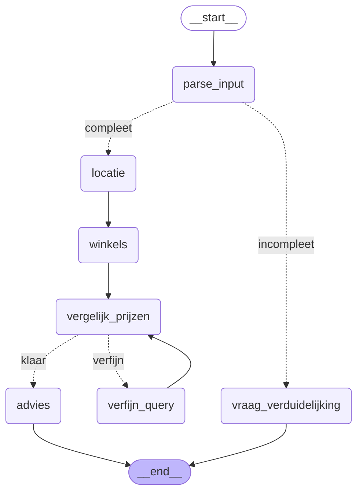

# T7 — Agent-workflow met feedbackloop

Gegenereerd uit de gecompileerde LangGraph (`app.get_graph().draw_mermaid()`),
dus dit is exact de structuur die draait — geen handgetekend schema.

## Graph-diagram



> Stippellijnen = conditionele edges (routers). Doorgetrokken lijnen = vaste edges.

## De twee beslispunten (validatie)

| Router | Na node | Beslissing | Routes |
|---|---|---|---|
| `valideer_extractie` | `parse_input` | Heeft de LLM bruikbare items geëxtraheerd? | `compleet` → locatie · `incompleet` → vraag_verduidelijking |
| `valideer_prijzen` | `vergelijk_prijzen` | Zijn er producten die nergens gematcht zijn én nog te versimpelen vallen, binnen de poging-limiet? | `verfijn` → verfijn_query · `klaar` → advies |

## De feedbackloop

```
vergelijk_prijzen ──klaar──► advies
        ▲                  │
        │ verfijn_query    │ verfijn
        └──────────────────┘
```

1. **`vergelijk_prijzen`** zoekt elk product bij AH + Jumbo via de vector-index
   (live API als fallback), met de eventueel verfijnde zoekterm uit `zoek_queries`.
2. **`valideer_prijzen`** controleert de matchkwaliteit. Onvindbaar bij *beide*
   winkels én nog te versimpelen → terug de loop in.
3. **`verfijn_query`** versimpelt de zoekterm (meest linkse, beschrijvende woord
   eraf — in het Nederlands staat de kern rechts) en verhoogt `match_poging`.
4. Terug naar **`vergelijk_prijzen`**.

**Begrenzing (termineert gegarandeerd):** de loop stopt zodra
(a) alles gematcht is, (b) `MAX_VERFIJN_POGINGEN = 2` bereikt is, of
(c) geen enkele onvindbare zoekterm nog te versimpelen valt (één woord over).

## Relevante state-kanalen

| Kanaal | Rol |
|---|---|
| `zoek_queries` | `originele itemnaam → huidige (verfijnde) zoekterm`; door de loop opgebouwd |
| `match_poging` | teller van uitgevoerde verfijnrondes; gereset bij elke nieuwe vraag |

## Diagram opnieuw genereren

```bash
.venv/Scripts/python.exe -c "import T7_test; print(T7_test.app.get_graph().draw_mermaid())"
```
